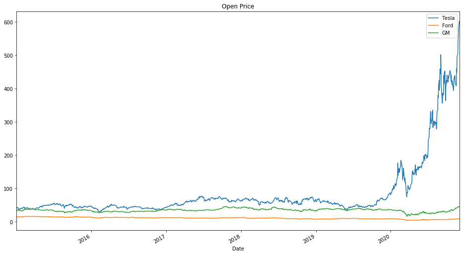
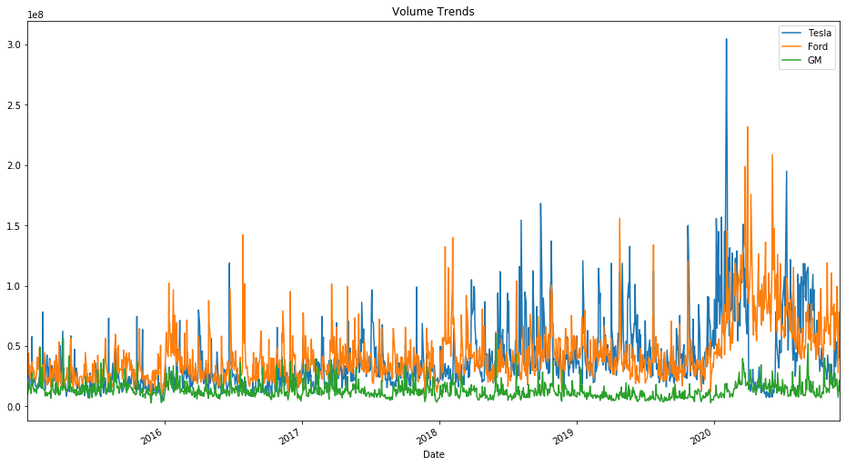
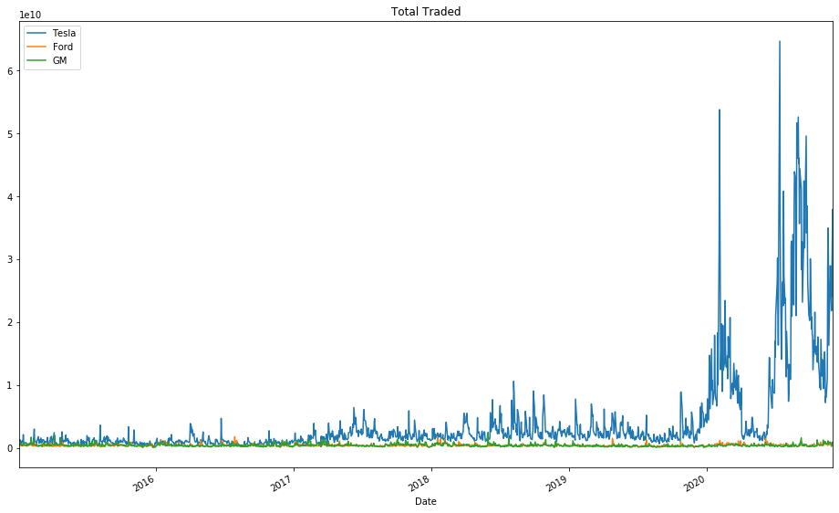

# Stock-Market-Analysis-Project
### Instructer by Jose Portilla from Pierian Data
I'll be analyzing stock data related to a few car companies, from Jan 1 2012 to Dec 1 2020.

```python
import pandas as pd
import numpy as np
%matplotlib inline
import matplotlib.pyplot as plt
import pandas_datareader.data as web
import datetime

start = datetime.datetime(2015, 1, 1)
end = datetime.datetime(2020, 12, 1)
```

## Getting the data
Tesla Stock (Ticker: TSLA on the NASDAQ), Ford and General Motors (GM)

```python
Tesla = web.DataReader("TSLA", 'yahoo', start, end)
Ford = web.DataReader("F", 'yahoo', start, end)
GM = web.DataReader("GM", 'yahoo', start, end)
```

## Visualizing the data
```python
Tesla['Open'].plot(label='Tesla',figsize=(16,9),title='Open Price')
Ford['Open'].plot(label='Ford')
GM['Open'].plot(label='GM')
plt.legend();
```
### Open Price Trend


```python
Tesla['Volume'].plot(label='Tesla',figsize=(16,9),title='Volume Trends')
Ford['Volume'].plot(label='Ford')
GM['Volume'].plot(label='GM')
plt.legend();
```
### Volume Trend



**What data is the maximun trading volumne for Tesla?**

```python
Tesla['Volume'].argmax()
> Timestamp('2020-02-04 00:00:00')
```

- Now I need to look at the total market cap of the company, not just the stock price. Unfortunately current data doesn't have that information of total units of stock present. So I need to do as a simple calcualtion to represent total money traded with multpling the Volume column by the Open price. Remember that this still isn't the actual Market Cap, its just a visual representation of the total amount of money being traded around using the time series.

```python
#Create a new column for each dataframe called "Total Traded" which is the Open Price multiplied by the Volume Traded.
Tesla['Total Trade'] = Tesla['Open']*Tesla['Volume']
Ford['Total Trade'] = Ford['Open']*Ford['Volume']
GM['Total Trade'] = GM['Open']*GM['Volume']
```
```python
#Plot this "Total Traded" against the time index.
Tesla['Total Trade'].plot(label='Tesla',figsize=(16,10),title='Total Traded')
Ford['Total Trade'].plot(label='Ford')
GM['Total Trade'].plot(label='GM')
plt.legend()
```
### Total Traded Trend

