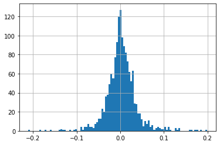
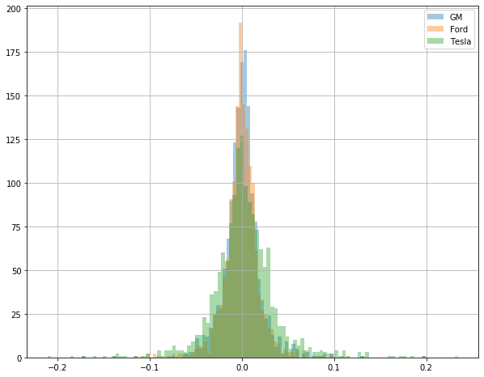
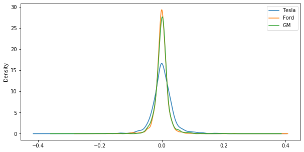
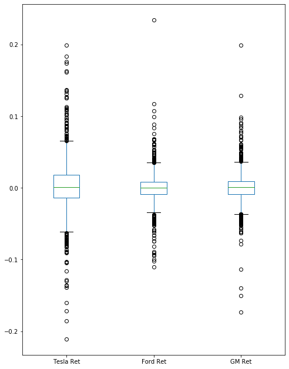
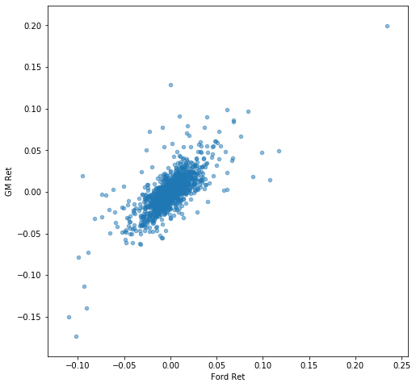
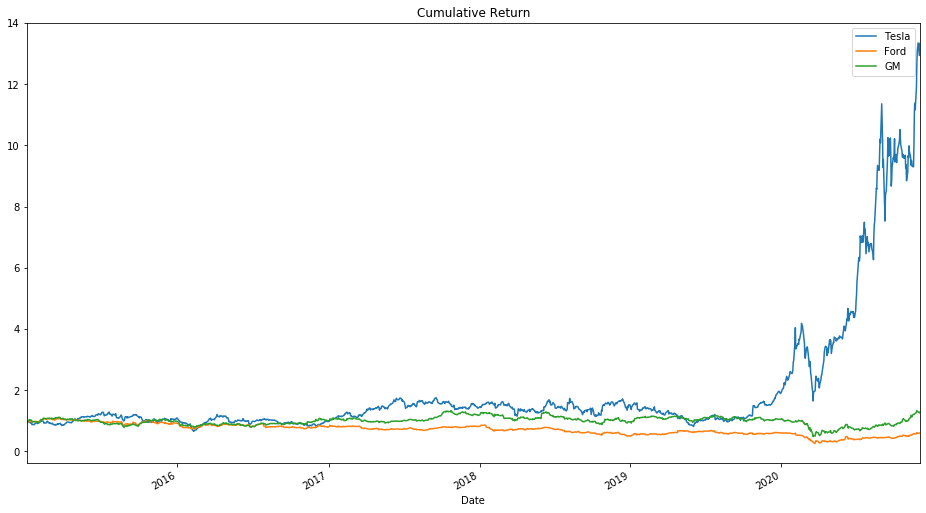

# Stock-Market-Analysis-Project
### Instructer by Jose Portilla from Pierian Data
I'll be analyzing stock data related to a few car companies, from Jan 1 2012 to Dec 1 2020.

```python
import pandas as pd
import numpy as np
%matplotlib inline
import matplotlib.pyplot as plt
import pandas_datareader.data as web
import datetime

start = datetime.datetime(2015, 1, 1)
end = datetime.datetime(2020, 12, 1)
```

## Getting the data
Tesla Stock (Ticker: TSLA on the NASDAQ), Ford and General Motors (GM)

```python
Tesla = web.DataReader("TSLA", 'yahoo', start, end)
Ford = web.DataReader("F", 'yahoo', start, end)
GM = web.DataReader("GM", 'yahoo', start, end)
```

## Visualizing the data
### 1. Open Price Trend
```python
Tesla['Open'].plot(label='Tesla',figsize=(16,9),title='Open Price')
Ford['Open'].plot(label='Ford')
GM['Open'].plot(label='GM')
plt.legend();
```


### 2. Volume Trend
```python
Tesla['Volume'].plot(label='Tesla',figsize=(16,9),title='Volume Trends')
Ford['Volume'].plot(label='Ford')
GM['Volume'].plot(label='GM')
plt.legend();
```

**What data is the maximun trading volumne for Tesla?**
```python
Tesla['Volume'].argmax()
> Timestamp('2020-02-04 00:00:00')
```

### 3. Total Traded Trend
- Now I need to look at the total market cap of the company, not just the stock price. Unfortunately current data doesn't have that information of total units of stock present. So I need to do as a simple calcualtion to represent total money traded with multpling the Volume column by the Open price. Remember that this still isn't the actual Market Cap, its just a visual representation of the total amount of money being traded around using the time series.
```python
#Create a new column for each dataframe called "Total Traded" which is the Open Price multiplied by the Volume Traded.
Tesla['Total Trade'] = Tesla['Open']*Tesla['Volume']
Ford['Total Trade'] = Ford['Open']*Ford['Volume']
GM['Total Trade'] = GM['Open']*GM['Volume']
```
```python
#Plot this "Total Traded" against the time index.
Tesla['Total Trade'].plot(label='Tesla',figsize=(16,10),title='Total Traded')
Ford['Total Trade'].plot(label='Ford')
GM['Total Trade'].plot(label='GM')
plt.legend()
```

- looks like there was huge amount of money traded for Tesla somewhere in mid 2020. What date was that and what happened?
```python
Tesla['Total Trade'].argmax()
> Timestamp('2020-07-13 00:00:00')
```
New: https://www.bloomberg.com/news/articles/2020-07-13/ten-thousand-day-traders-an-hour-pour-into-tesla

### 4. Moving Average Trend for General Motors
```python
#MA (Moving Averages). Plot of MA50 AND MA200 for GM
GM['MA50']=GM['Open'].rolling(50).mean()
GM['MA200']=GM['Open'].rolling(200).mean()
GM[['Open','MA50','MA200']].plot(figsize=(16,10))
```


### 5. Scatter Matrix for Tesla, Ford and GM
```python 
from pandas.plotting import scatter_matrix
#GM=GM.drop(['MA50','MA200'],axis=1)
car_merged = pd.concat([Tesla['Open'],Ford['Open'],GM['Open']],axis=1)
car_merged.columns=['Tesla Open','F Open', 'GM Open']
scatter_matrix(car_merged,figsize=(8,8),alpha=0.2,hist_kwds={'bins':50})
```

- There is a positive correlation between Ford and Genaral Motors. Tesla is quite a bit different has some different behivor and that makes sense because we saw there was a huge jump is Tesla stock price while General Motors and Ford knid of Stayed at the same level.

### 6. CandleStick Chart for Tesla in January 2020
```python
from mplfinance.original_flavor import candlestick_ohlc
from matplotlib.dates import DateFormatter, WeekdayLocator,DayLocator,MONDAY,date2num

Tesla_reset = Tesla.loc['2020-01'].reset_index()
Tesla_reset['date_ax']=Tesla_reset['Date'].apply(lambda date:date2num(date))
#date2num:change a date into a number 

list_of_cols=['date_ax','Open','High','Low','Close']
tesla_values=[tuple(vals) for vals in Tesla_reset[list_of_cols].values]

mondays = WeekdayLocator(MONDAY)        # major ticks on the mondays
alldays = DayLocator()                  # minor ticks on the days
weekFormatter = DateFormatter('%b %d')  # e.g., Jan 12
dayFormatter = DateFormatter('%d')      # e.g., 12
```
```python
fig, ax = plt.subplots()
fig.subplots_adjust(bottom=0.2)
ax.xaxis.set_major_locator(mondays)
ax.xaxis.set_minor_locator(alldays)
ax.xaxis.set_major_formatter(weekFormatter)

candlestick_ohlc(ax, tesla_values, width=0.8,colorup='g',colordown='r')
```


## Basic Financial Analysis
### 1. Daily Percentage Change
- If the price fluctuate wildly then this value would be larger whether it's a larger negative number or a large positive number depending on whether you're gaining or losing.
```python
Tesla['Returns']= Tesla['Close'].pct_change() #Same:Tesla['Returns']= (Tesla['Close']/Tesla['Close'].shift(1))-1
Ford['Returns']= Ford['Close'].pct_change()
GM['Returns']= GM['Close'].pct_change()
```
#### Histogram
```python
Tesla['Returns'].hist(bins=100)
Ford['Returns'].hist(bins=100)
GM['Returns'].hist(bins=100)
```
*TSLA**F**GM*
##### Stacked Histogram
```python
GM['Returns'].hist(bins=100,label='GM',figsize=(10,8),alpha=0.4)
Ford['Returns'].hist(bins=100,label='Ford',figsize=(10,8),alpha=0.4)
Tesla['Returns'].hist(bins=100,label='Tesla',figsize=(10,8),alpha=0.4)
plt.legend()
```
- As you see above histograms, Tesla has wider distribution than other. So Tesla can actually go up to around negative point to and beyond positive point to. The stacked histogram below shows more clear that Tesla has more volitility than other stocks.

#### Kernel Density Estimation
```python
Tesla['Returns'].plot.kde(label='Tesla',figsize=(10,5))
Ford['Returns'].plot.kde(label='Ford')
GM['Returns'].plot.kde(label='GM')
plt.legend()
```

- Ford clearly peaking much more stable than Tesla and a little more stable than GM. So Ford with the highest peak centered around zero that a lot of daily return tend to be the same. It's relatively flat stock in comparison to Tesla. You can see Tesla here is little wider meaning a little more volatility.
#### Box Plot
```python
box_df=pd.concat([Tesla['Returns'],Ford['Returns'],GM['Returns']],axis=1)
box_df.columns=['Tesla Ret','Ford Ret','GM Ret']
box_df.plot.box(figsize=(8,11))
```

- Here again that Tesla returns quite a bit more of a wide distribution a lot more outliers.
#### Comparing Daily Returns between Stocks
```python
scatter_matrix(box_df,figsize=(8,8),alpha=0.2,hist_kwds={'bins':100})
```

- It looks like Ford and GM do have some sort of possible relationship.
#### Scatter Plot of Ford and GM
```python
box_df.plot.scatter(x='Ford Ret',y='GM Ret',alpha=0.5,figsize=(8,8))
```


### 2. Cumulative Daily Returns
- Cumulative return is computedreativeto the day investment is made. If cumulative return is above one, you are making profits else you are in loss.
```python
Tesla['Cumulative Return']=(1+Tesla['Returns']).cumprod()
Ford['Cumulative Return']=(1+Ford['Returns']).cumprod()
GM['Cumulative Return']=(1+GM['Returns']).cumprod()
```
```python
Tesla['Cumulative Return'].plot(label='Tesla',figsize=(16,9),title='Cumulative Return')
Ford['Cumulative Return'].plot(label='Ford')
GM['Cumulative Return'].plot(label='GM')
plt.legend()
```

